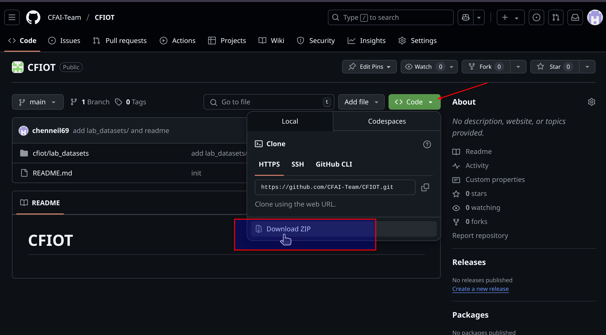

# README

## Purpose

-   to download .z01 and .zip files
-   unzip them back into a .csv file (~= 276 MB)

## Steps (under Ubuntu Linux command line for example)

-   download and **unzip** these files



**unzip** the downloaded zip file, the folder sturcture should look like this:

```shell
└── CFIOT-main
    ├── cfiot
    │   └── lab_datasets
    │       ├── lab_dataset.z01
    │       ├── lab_dataset.zip
    │       └── README.md
    └── README.md
```

-   **cd** to `lab_datasets/`

```shell
$ cd CFIOT-main/cfiot/lab_datasets
```

-   follow the steps (first zip to join splits, then unzip back to .csv) [[for more details](https://linuxconfig.org/how-to-split-zip-archive-into-multiple-blocks-of-a-specific-size)]

```shell
$ zip -s 0 lab_dataset.zip --output merged_dataset_forward_fill.zip

copying: merged_dataset_forward_fill.csv

$ unzip merged_dataset_forward_fill.zip

Archive:  merged_dataset_forward_fill.zip

  inflating: merged_dataset_forward_fill.csv

```

-   the **merged_dataset_forward_fill.csv** is the .csv for your study

## Why?

-   Due to the fact that GitHub only allows **maximum 25MB / per single file** imitation, we have to break down the original ~276MB .csv into smaller zip files to upload to GitHub repo.

-   Other than Linux command line; file archiving tools like `WinRAR`, `7-Zip` or other file utilities under Windows and Mac should still do the job. Please help yourself Google / ChatGPT for detailed steps should you face difficulties.
